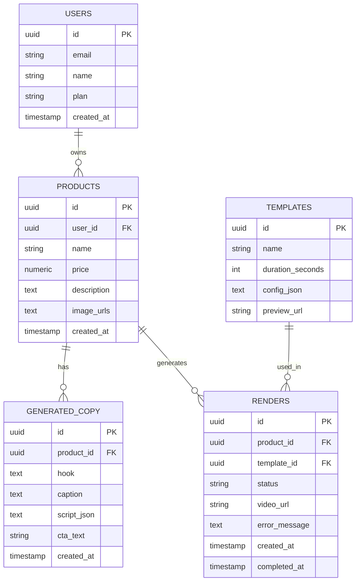

# ERD.md — Entity Relationship Diagram

## Diagram

## Penjelasan Tabel

### `users`
Data akun pengguna aplikasi.
- `plan` — untuk kebutuhan freemium/limit render di kemudian hari

### `products`
Data produk yang diinput user. Satu user bisa punya banyak produk.
- `image_urls` — disimpan sebagai JSON array string (URL ke storage, bukan file langsung)
- Gambar & video **tidak pernah disimpan langsung di DB** — hanya reference URL ke object storage (Vercel Blob/Cloudflare R2)

### `generated_copy`
Hasil generate AI (Gemini/DeepSeek) untuk satu produk. Satu produk bisa punya beberapa versi copy (misal user generate ulang).
- `script_json` — array per-scene, format: `[{ "scene": 1, "text": "..." }, ...]`

### `templates`
Master data template video yang tersedia (bukan diisi user, tapi data seed dari admin/developer).
- `config_json` — parameter template (posisi elemen, durasi tiap scene, dll), tergantung render engine yang dipakai

### `renders`
Job render video. Satu produk bisa di-render dengan beberapa template berbeda (hasil beda-beda).
- `status` — enum: `queued`, `processing`, `done`, `failed`
- `video_url` — kosong sampai status `done`
- `error_message` — diisi kalau `status = failed`, untuk debugging & ditampilkan ke user

## Catatan Desain

- Relasi `products → generated_copy` dan `products → renders` sengaja one-to-many, bukan one-to-one, supaya user bisa generate ulang copy atau render dengan template lain tanpa kehilangan histori sebelumnya.
- Kalau nanti butuh fitur "pilih copy versi mana yang dipakai untuk render", tambahkan kolom `generated_copy_id` (FK) di tabel `renders`.
- Index yang penting untuk performa: `products(user_id)`, `renders(product_id)`, `renders(status)` (untuk query job yang masih `queued`/`processing`).
